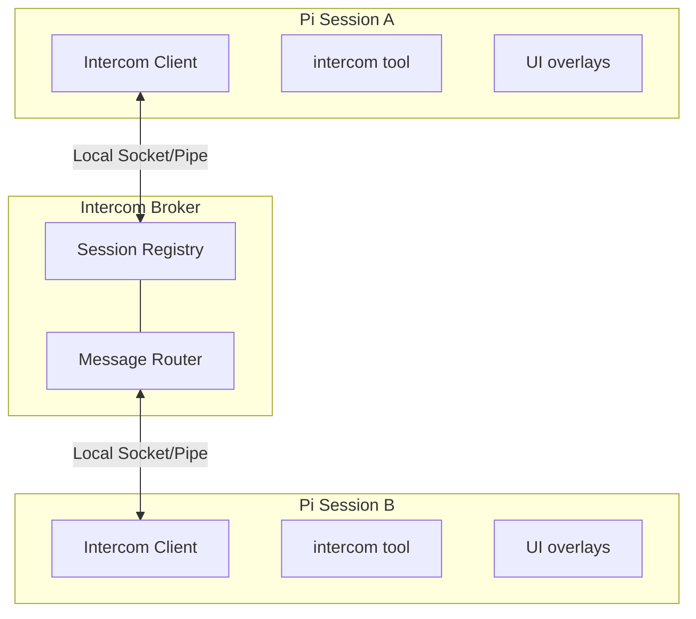

<p>
  
</p>

# Pi Intercom

Direct 1:1 messaging between pi sessions on the same machine. Send context, findings, or requests from one session to another — whether you're driving the conversation or letting agents coordinate.

```text
User flow: press Alt+M or run /intercom to pick a session and send a message
```

## Why

Sometimes you're running multiple pi sessions — one researching, one executing, one reviewing. Pi-intercom lets you:

- **User-driven orchestration** — Send context or findings from your research session to your execution session
- **Agent collaboration** — An agent can reach out to another session when it needs help or wants to share results
- **Session awareness** — See what other pi sessions are running and their current status

Unlike pi-messenger (a shared chat room for multi-agent swarms), pi-intercom is for targeted 1:1 communication where you pick the recipient.

Pi-intercom also integrates well with [pi-subagents](https://github.com/nicobailon/pi-subagents): delegated child agents get a child-only `contact_supervisor` tool when `pi-subagents` supplies bridge metadata. Use `reason: "need_decision"` for blocking clarification, `reason: "interview_request"` for multiple structured supervisor answers, and `reason: "progress_update"` for meaningful plan-changing updates. Normal sessions only see the regular `intercom` tool.

## In One Minute

Each pi session that has `pi-intercom` loaded and enabled connects to a tiny local broker over a local IPC transport. The broker keeps track of connected sessions and routes direct messages to the one you target by name or session ID. The extension gives you both a tool (`intercom`) and a small overlay UI (`/intercom` or `Alt+M`). Incoming messages are rendered inline inside the recipient session, can trigger a turn immediately by default, and are also stored in Pi session history as extension entries. If you want a stricter local trust posture, `inboundTrigger` can reduce or disable auto-triggering.

## Install

```bash
pi install npm:pi-intercom
```

Then restart Pi. The extension auto-connects to the broker on startup and registers the bundled `pi-intercom` skill for common coordination patterns.

Pi loads the extension directly, including its native **Alt+I** contact-copy shortcut, so no wrapper command or shell alias is required. You can still alias your usual Pi invocation for convenience, but unlike adapters that need a wrapper to add terminal behavior, an alias does not enable any additional pi-intercom features.

Pi-intercom is also protocol-compatible with the companion Codex, Claude, and OpenCode adapters. They share the same local broker and runtime directory, so sessions from all four hosts appear in the same session list and can send, ask, reply, and recover messages across host boundaries. The first connected adapter can start the broker; Pi does not need to be launched first.

**Recommended:** Add this snippet to your project's `AGENTS.md` to help agents understand when to coordinate across sessions:

```xml
<pi-intercom>
Coordinate with other local pi sessions on related codebases. Use `/skill:pi-intercom` for patterns.

**When:** Same codebase (parallel work), reference codebase (consulting patterns), related repos (shared libraries).

**Not when:** Unrelated codebases, trivial questions, or when you can proceed independently.

**Principle:** Prefer `send` for notifications; `ask` only when blocked waiting for input.
</pi-intercom>
```

A session becomes intercom-connected when all of these are true:
- the `pi-intercom` extension is installed and loaded in that session
- `enabled` is not set to `false` in the intercom config file, which defaults to `~/.pi/agent/intercom/config.json`
- the session has started or reloaded after the extension was installed
- the local broker is running or can be auto-started

The session list only shows intercom-connected sessions, not every open Pi process on the machine.

If a session is unnamed, pi-intercom now exposes a runtime-only fallback alias like `subagent-chat-1a2b3c4d` so other sessions can still target it. That alias is not persisted as the Pi session title, so `pi --resume` can keep showing the transcript snippet instead of a generic `session-...` name.

## Quick Start

### Common Interface Across Hosts

The intercom packages use the same keyboard convention wherever the host exposes the required terminal hooks:

| Action | Pi | Codex (`coi`) | Claude (`cci`/`ccim`) | OpenCode |
|--------|----|---------------|------------------------|----------|
| Pick a session and send | `/intercom` or **Alt+M** | **Alt+M** | `/claude-intercom:intercom` or **Alt+M** | `/intercom` or **Alt+M** |
| Copy this session's contact target | `/intercom-id` or **Alt+I** | **Alt+I** | `/claude-intercom:intercom-id` or **Alt+I** | `/intercom-id` or **Alt+I** |

Codex does not currently expose a native custom slash-command API, so its `coi` wrapper provides the shared keyboard shortcuts instead. Claude namespaces installed plugin commands and its terminal shortcuts require the attached `cci` or `ccim` wrapper. For those adapters, a shell alias is recommended because it makes the wrapper the normal launch command and ensures the shortcuts and wakeable intercom behavior are present. Pi loads those features natively, so an alias is optional here.

The contact text copied by **Alt+I** or `/intercom-id` is deliberately host-neutral. Paste it into any supported agent to identify the exact target without requiring that agent to look the session up by a machine-specific path or transient display label.

### From the Keyboard

Press **Alt+M** or type `/intercom` to open the session list overlay:

1. **Select a session** — Use arrow keys to pick a target session
2. **Find and select** — Start typing to filter long session lists
3. **Compose message** — Write or paste a multiline message; use Shift+Enter for a newline
4. **Send** — Press Enter to send, Escape to cancel

Press **Alt+I** or run `/intercom-id` to copy a short handoff snippet for the current session. The snippet uses the session's unique name when possible, falling back to the stable intercom session ID when names are duplicated.

### From the Agent

The agent can list sessions and send messages using the `intercom` tool. Tool calls and results render as compact transcript rows so send/ask/reply flows are easy to scan. For common patterns like planner-worker delegation, the bundled `pi-intercom` skill provides copy-paste ready examples:

```typescript
// List active sessions
intercom({ action: "list" })
// → **Current session:**
// → • executor (20d43841) — ~/projects/api (claude-sonnet-4) [self, idle]
// → **Other sessions:**
// → • research (6332faab) — ~/projects/api (claude-sonnet-4) [same cwd, thinking]

// Send a message
intercom({ action: "send", to: "research", message: "Check if UserService.validate() handles null" })
// → Message sent to research

// Check connection status
intercom({ action: "status" })
// → Connected: Yes, Session ID: abc123, Active sessions: 3

// Send with attachments (code snippets, files, or context)
intercom({
  action: "send",
  to: "worker",
  message: "Here's the fix:",
  attachments: [{
    type: "snippet",
    name: "auth.ts",
    language: "typescript",
    content: "function validate(user: User) { ... }"
  }]
})
```

### Receiving Messages

When a message arrives, it appears inline in your chat with the sender's info and a reply hint:

```
**From research** (~/projects/api)

To reply, use the intercom tool: intercom({ action: "reply", message: "..." })

Found the issue — UserService.validate() doesn't check for null input.
See auth.ts:142-156.
```

The reply hint (enabled by default) points to `intercom({ action: "reply", ... })`, so recipients do not need raw sender or `replyTo` IDs. Incoming messages are first written to a durable per-session inbox. Messages arriving within a 300 ms quiet window are combined into one model turn, with a 1-second maximum batching delay so a steady stream cannot postpone delivery forever. Busy sessions keep the batch queued until they are idle. Every original sender, message ID, timestamp, attachment, and reply context remains available in the batch details.

The sender receives two distinct delivery states in structured tool details: `accepted` means the broker accepted the message for routing, while `delivered` means the receiver durably queued it and acknowledged the delivery. Outbound messages are also written to a durable per-session outbox before transmission. If the broker disconnects between acceptance and receiver acknowledgement, the next connection automatically replays the original target, payload, and message ID. Attachment content is included in the agent-visible body, and delivered messages are rendered inline and stored in Pi session history.

## Workflow: Planner-Worker Coordination

The most natural use of pi-intercom is splitting a task between two sessions — one holds the big picture, the other does the hands-on work. When the worker hits an ambiguity ("should I optimize for readability or performance here?"), they ask without losing context.

### Setup

Open two terminals and start pi in each. Name them so they can find each other:

```
# Terminal 1                    # Terminal 2
/name planner                   /name worker
```

Verify they see each other from either session:

```typescript
intercom({ action: "list" })
// → • worker — ~/projects/api (claude-sonnet-4) [idle]
```

### The Conversation

Here's how a typical exchange looks. The planner delegates with `send` (fire-and-forget). The worker uses `ask` for anything that needs a response — questions, discoveries, completion reports. `ask` waits up to 30 seconds so a prompt answer can return in the same tool result, then releases the worker and delivers any late answer as a new intercom message.

**Planner sends a task:**
```typescript
intercom({
  action: "send",
  to: "worker",
  message: "Task-3: Add retry logic to API client. Key files: src/api/client.ts, src/api/types.ts. Ask if anything's unclear."
})
```

**Worker hits an ambiguity — asks and waits:**
```typescript
intercom({
  action: "ask",
  to: "planner",
  message: "Should retry apply to all endpoints or just idempotent ones? Also, max retry count and backoff strategy?"
})
// → Reply from planner: Only GET/PUT/DELETE — never POST. Max 3 retries, exponential backoff starting at 100ms.
// Worker continues implementing with the answer, same turn, full context.
```

**Worker finds something unexpected — escalates and waits:**
```typescript
intercom({
  action: "ask",
  to: "planner",
  message: "Found: fetchWithTimeout swallows network errors. Fixing this changes the error shape. OK to proceed?"
})
// → Reply from planner: Yes, surface the error types. The current behavior is a bug.
```

**Worker reports completion:**
```typescript
intercom({
  action: "ask",
  to: "planner",
  message: "Task-3 done. Added RetryPolicy type, applied to GET/PUT/DELETE, surfaced NetworkError, 4 tests passing."
})
// → Reply from planner: Looks good. Move on to task-4.
```

### Communication Patterns

| Pattern | Action | Why |
|---------|--------|-----|
| **Task Delegation** | Planner uses `send` | Fire-and-forget. Planner doesn't need to wait for an ack. |
| **Clarification Request** | Worker uses `ask` | Worker needs the answer to proceed. Blocks until reply. |
| **Discovery Escalation** | Worker uses `ask` | Worker needs approval before changing course. |
| **Completion Report** | Worker uses `ask` | Planner might have follow-up instructions or the next task. |

### Reply Hints

When `replyHint` is enabled (the default), incoming messages include the exact `intercom()` call to respond:

```
**From planner** (~/projects/api)

To reply, use the intercom tool: intercom({ action: "reply", message: "..." })

Only GET/PUT/DELETE — never POST. Max 3 retries with exponential backoff starting at 100ms.
```

This matters because the agent receiving the message doesn't need to reconstruct raw `to` and `replyTo` IDs — the hint is right there. Combined with idle-gated `triggerTurn` delivery, it enables real back-and-forth conversation without interrupting work in progress. If the reply happens later instead of in the triggered turn, `intercom({ action: "reply" })` falls back to the single unresolved inbound ask, and `intercom({ action: "pending" })` shows who is still waiting.

### `send` vs `ask`

`send` is non-blocking with respect to a reply: it waits only for the receiver's durable-enqueue acknowledgement, then returns. By default, it sends immediately even in interactive sessions. If you want an approval dialog before non-reply sends, set `confirmSend: true` in config. Replies that include `replyTo` still skip confirmation so reply-hint flows can continue without an extra approval step.

`ask` sends the message and waits up to 30 seconds for the recipient. A prompt reply comes back as the tool result, so the agent continues in the same turn with full context. If nobody replies within 30 seconds, the tool returns control without an error and keeps the request open asynchronously; a late reply arrives as a new intercom message. No confirmation dialog — if you're asking and waiting, the intent is clear.

`reply` is receiver-side sugar for replying to an inbound ask. In the turn triggered by an incoming intercom ask, `intercom({ action: "reply", message: "..." })` targets that exact sender and message automatically. If you reply later, it falls back to the single unresolved inbound ask. If multiple asks are pending, use `intercom({ action: "pending" })` to inspect them and then call `reply` with `to` to disambiguate.

The planner typically uses `send`. If you prefer manual approval for outgoing non-reply messages, turn on `confirmSend: true`. The worker uses `ask` for everything (no confirmation needed, gets answers inline), so it can operate autonomously either way.

## Workflow: Subagent-to-Supervisor Escalation

This workflow requires [`pi-subagents`](https://github.com/nicobailon/pi-subagents) to be installed and to supply child bridge metadata. When `pi-subagents` spawns a delegated child with that metadata, the child session gets a subagent-only `contact_supervisor` tool in addition to the regular `intercom` tool. Normal sessions never see `contact_supervisor`.

### When the Tool Appears

`contact_supervisor` only registers when `pi-subagents` sets all of these environment variables:

- `PI_SUBAGENT_ORCHESTRATOR_TARGET` — the supervisor session name or ID
- `PI_SUBAGENT_RUN_ID` — the run identifier
- `PI_SUBAGENT_CHILD_AGENT` — the agent type
- `PI_SUBAGENT_CHILD_INDEX` — the child index within the run

If any are missing, the session falls back to the regular `intercom` tool.

### Three Reasons

| Reason | Behavior | Use When |
|--------|----------|----------|
| `need_decision` | Waits up to 30 seconds, then continues asynchronously if unanswered | The subagent is blocked, uncertain, needs approval, or faces a product/API/scope decision |
| `interview_request` | Waits up to 30 seconds for structured answers, then continues asynchronously | The subagent needs multiple machine-readable answers from the supervisor in one exchange |
| `progress_update` | Fire-and-forget update to the supervisor | Meaningful progress or unexpected discoveries that change the plan |

Do not use `contact_supervisor` for routine completion handoffs. Return the final subagent result normally through `pi-subagents`.

### Example: Blocked Subagent Asks for Guidance

```typescript
contact_supervisor({
  reason: "need_decision",
  message: "The auth service returns 403 instead of 401 for expired tokens. Should I treat 403 as a re-auth trigger or a hard failure?"
})
// → Reply from supervisor: Treat 403 as re-auth trigger. Update the token refresh logic.
```

### Example: Structured Supervisor Interview

```typescript
contact_supervisor({
  reason: "interview_request",
  message: "Please answer these before I continue the migration.",
  interview: {
    title: "API migration choices",
    questions: [
      { id: "api", type: "single", question: "Which API should I target?", options: ["Stable API", "Experimental API"] },
      { id: "constraints", type: "text", question: "What constraints should I preserve?" }
    ]
  }
})
// → Reply from supervisor: { "responses": [{ "id": "api", "value": "Stable API" }, ...] }
```

### Example: Progress Update

```typescript
contact_supervisor({
  reason: "progress_update",
  message: "Discovered the bug is in the retry wrapper, not the API client. Fixing the wrapper will also close issue #42."
})
// → Progress update sent to supervisor planner
```

### What the Supervisor Sees

The supervisor receives a formatted message with run metadata:

```
**From subagent-worker-78f659a3-1**

Subagent needs a supervisor decision.
Run: 78f659a3
Agent: worker
Child index: 0

Which API should I use?
```

Reply hints work the same as regular `intercom` ask/reply flows. The supervisor can reply with `intercom({ action: "reply", message: "..." })` and the subagent receives the answer as the tool result.

For `interview_request`, the supervisor message includes the structured questions plus a fenced JSON answer example using this stable shape:

```json
{
  "responses": [
    { "id": "api", "value": "Stable API" },
    { "id": "constraints", "value": "Keep the public error shape unchanged." }
  ]
}
```

The supervisor can reply with plain JSON or a fenced `json` block. If the reply matches the `{ "responses": [...] }` shape and references valid question ids/options, the child tool result includes it in `details.structuredReply` while still showing the raw reply text.

## Tool Reference

### intercom

| Parameter | Type | Description |
|-----------|------|-------------|
| `action` | string | `"list"`, `"send"`, `"ask"`, `"reply"`, `"pending"`, or `"status"` |
| `to` | string | Target session name or ID (for send/ask, or to disambiguate reply) |
| `message` | string | Message text (for send/ask/reply) |
| `attachments` | array | Optional `file`, `snippet`, or `context` attachments |
| `replyTo` | string | Optional message ID for threading or replying to an `ask` |

### contact_supervisor

Only registered in sessions where `pi-subagents` supplied the required child bridge metadata. Contacts the supervisor session that delegated the current task.

| Parameter | Type | Description |
|-----------|------|-------------|
| `reason` | string | `"need_decision"` (soft-waiting), `"interview_request"` (soft-waiting structured questions), or `"progress_update"` (fire-and-forget) |
| `message` | string | The decision request, optional interview note, or progress update |
| `interview` | object | Required for `interview_request`: `{ title?, description?, questions: [...] }` |

**`need_decision`** — Sends a formatted ask to the supervisor and waits up to 30 seconds. A prompt reply comes back as the tool result; otherwise the request remains open and a late reply arrives asynchronously. Includes run metadata in the message so the supervisor knows which subagent is asking.

**`interview_request`** — Sends a formatted, agent-readable interview to the supervisor and waits up to 30 seconds. Questions use a local pi-interview-like shape: `{ id, type, question, options?, context? }` where `type` is `single`, `multi`, `text`, `image`, or `info`. `info` questions are context-only and do not need responses. The supervisor reply should be JSON with `{ "responses": [{ "id": "...", "value": ... }] }`. Prompt parsed replies are returned in `details.structuredReply`; late replies arrive asynchronously.

**`progress_update`** — Sends a non-blocking update to the supervisor. Returns immediately after delivery. Use only for meaningful progress or unexpected discoveries that change the plan.

### intercom actions

**`list`** — Returns the current session plus other active intercom-connected sessions with name, short ID, working directory, model, and live status. Status is derived automatically from Pi lifecycle events: `idle`, `thinking`, or `tool:<name>`.

**`send`** — Sends a message to the specified session. By default it sends immediately, including in interactive sessions. Set `confirmSend: true` in config if you want a confirmation dialog for non-reply sends. Replies that include `replyTo` skip confirmation. Structured results distinguish broker `accepted` from receiver-acknowledged `delivered` and include a stable failure `code` when delivery fails.

**`ask`** — Sends a message and waits up to 30 seconds for the recipient to reply. A prompt reply is returned as the tool result. After 30 seconds the tool returns a successful pending result so the agent can continue, while a late reply arrives as a new intercom message. The request remains replyable for the existing 10-minute ask expiry. Set `PI_INTERCOM_ASK_WAIT_MS` to change the blocking window. No confirmation dialog. Only one synchronously waiting `ask` is allowed per session at a time.

**`reply`** — Replies to the current intercom-triggered message if there is one. Otherwise it falls back to the single unresolved inbound ask. If multiple asks are pending, pass `to` or inspect them with `pending` first. Under the hood this is still a normal `send` with the exact `replyTo` value.

**`pending`** — Lists unresolved inbound asks with sender, message ID, elapsed time, and a short preview. Useful when replying after the original triggered turn.

**`status`** — Shows connection status, session ID, total count of active sessions (including the current session), and queued inbox, outbox, and pending-ask counts.

## Keyboard Shortcuts

| Key | Action |
|-----|--------|
| Alt+M | Open session list overlay |
| Alt+I | Copy this session's intercom contact target, falling back to editor insert |
| ↑/↓ | Navigate session list |
| Enter | Select session / Send message |
| Shift+Enter | Insert a newline while composing |
| Escape | Cancel / Close overlay |

The session picker is searchable, multiline bracketed paste is preserved, and displayed session metadata is sanitized before it reaches the terminal.

## Config

Create `~/.pi/agent/intercom/config.json`:

```json
{
  "brokerCommand": "npx",
  "brokerArgs": ["--no-install", "tsx"],
  "confirmSend": false,
  "inboundTrigger": "always",
  "enabled": true,
  "replyHint": true,
  "status": "researching"
}
```

| Setting | Default | Description |
|---------|---------|-------------|
| `brokerCommand` | `"npx"` | Advanced trusted override for the broker executable. The default value is hardened internally to launch the resolved bundled `tsx` CLI through the current Node executable instead of resolving `npx` through `PATH`. |
| `brokerArgs` | `["--no-install", "tsx"]` | Advanced trusted arguments passed to custom `brokerCommand` before the broker script path |
| `confirmSend` | false | Show a confirmation dialog before non-reply sends from an interactive session with UI |
| `inboundTrigger` | `"always"` | Auto-trigger policy for inbound broker messages: `"always"`, `"replies"`, or `"never"`. Local in-process subagent relay events still trigger the addressed session. |
| `enabled` | true | Enable/disable intercom entirely |
| `replyHint` | true | Include reply instruction in incoming messages |
| `status` | — | Optional custom status suffix shown after the automatic lifecycle status, for example `thinking · researching` |

If `config.json` cannot be parsed or contains an invalid value, pi-intercom logs the error and fails closed for inbound broker auto-triggering by using `inboundTrigger: "never"` until the config is fixed.

Custom broker commands are trusted local configuration: anyone who can edit this config can choose the executable used for future broker auto-spawns. For example, if you have Bun installed and want it to start the broker directly, use:

```json
{
  "brokerCommand": "bun",
  "brokerArgs": []
}
```

Pi-intercom publishes live session status automatically. Sessions register as `idle`, switch to `thinking` while the agent is running, show `tool:<name>` during tool execution, and return to `idle` on agent completion. If `status` is set in config, it is appended as context instead of replacing the lifecycle status.

By default, runtime state and config live under `~/.pi/agent/intercom`. If Pi is launched with `PI_CODING_AGENT_DIR`, pi-intercom uses `$PI_CODING_AGENT_DIR/intercom` instead, including `config.json`, broker PID/lock files, sockets, durable inboxes/outboxes, ask state, and launcher state. `PI_INTERCOM_ASK_WAIT_MS` controls the foreground ask wait (30 seconds by default); `PI_INTERCOM_ASK_TIMEOUT_MS` controls how long a deferred ask remains replyable (10 minutes by default).

## How It Works



The broker is a standalone TypeScript process that manages session registration and message routing. It auto-spawns when the first intercom-enabled session needs it and exits after 5 seconds when the last connected session disconnects. Clients now reconnect automatically if the broker disappears and later comes back.

Messages use strict `pi-intercom` protocol v3 over length-prefixed JSON on a local socket/pipe transport (4-byte length + JSON payload). Registration rejects incompatible protocol versions instead of attempting a partially compatible connection. The protocol includes request correlation, structured error codes, delivery IDs, receiver acknowledgements and rejections, retry deduplication by sender session plus message ID, acknowledged ask controls, payload and pending-work bounds, a frame-size cap, byte-weighted per-connection rate limiting, and no-op presence coalescing.

The receiver acknowledges only after atomically writing the message to its per-session inbox. Delivery is therefore at least once across reconnects and reloads. There is one narrow crash window after a batch is injected into Pi but before its inbox entries are marked consumed; after recovery, that batch can be shown again rather than silently lost.

Session IDs are the trusted addressing key. Duplicate names remain allowed for same-user workflows, but sends to ambiguous names fail and users should target the stable session ID shown by `list`/`status` in trust-sensitive flows. The broker owns local trust metadata such as `trustedLocal`; `peerUid` is reserved for runtimes that can expose real peer credentials and is left unset otherwise. Client-supplied cwd/model/pid/status are display metadata, not authentication.

Async extension work (startup, inbound flushes, reconnects, overlays, and relays) no-ops if the session shuts down or reloads before it settles.

Runtime files live at `~/.pi/agent/intercom/` by default, or `$PI_CODING_AGENT_DIR/intercom/` when `PI_CODING_AGENT_DIR` is set:
- `broker.sock` — Unix domain socket for communication (macOS/Linux only; Windows uses a named pipe instead)
- `broker-launch.vbs` — Windows helper script used to launch the broker without a console window
- `broker.pid` — Broker process ID
- `broker.spawn.lock` — Auto-spawn lock file
- `broker.port.json` — Dynamic localhost TCP endpoint, only when Windows TCP transport is explicitly enabled
- `broker-asks.json` — Expiring ask/reply authorization edges; restored as deferred after broker restart
- `config.json` — User configuration
- `inbox/<session-hash>.json` — Durable ordered inbound messages and receiver-side deduplication state
- `outbox/<session-hash>.json` — Durable unfinished outbound messages replayed after reconnect

## Design Decisions

**Local IPC instead of TCP.** Same-machine only by design. `pi-intercom` uses Unix sockets on macOS/Linux and a named pipe on Windows, which keeps setup simple and avoids port management. Windows TCP is available only as an explicit escape hatch with `PI_INTERCOM_TRANSPORT=tcp` (or `PI_INTERCOM_TCP=1`) for environments where named pipes are blocked. In that mode the broker binds a dynamic `127.0.0.1` port, records the endpoint plus a local secret under the intercom state dir, and requires that secret before health or registration succeeds. Health replies do not echo the secret, so a random localhost process cannot discover it through the broker protocol.

**Auto-spawn with file lock.** The broker starts on first connection and exits after 5 seconds idle. There is no daemon to manage. A spawn lock file, keyed by PID and timestamp, prevents duplicate brokers when multiple sessions start at once.

**`ask` has a soft foreground wait.** The client waits up to 30 seconds for a matching reply and returns a prompt reply as the tool result. After that soft wait expires, the sender continues and asks the broker to change the edge from blocking to deferred. That control operation is explicitly acknowledged. Deferred asks permit reverse asks, remain late-replyable until the 10-minute expiry, and survive broker restart without recreating a blocking dependency. Reply hints make the flow practical by preserving the exact reply context.

## pi-intercom vs pi-messenger

| Aspect | pi-intercom | pi-messenger |
|--------|-------------|--------------|
| **Model** | Direct 1:1 messaging | Shared chat room |
| **Primary use** | User orchestrating sessions | Autonomous agent coordination |
| **Discovery** | Broker-based (real-time) | File-based registry |
| **Messages** | Private, session-to-session | Broadcast to all agents |
| **Persistence** | Durable delivery inbox plus Pi session history | Shared coordination files |

Use pi-messenger for multi-agent swarms working on a shared task. Use pi-intercom when you want to manually coordinate your own sessions or have one agent reach out to another specific session.

## File Structure

```
~/.pi/agent/extensions/pi-intercom/
├── package.json
├── index.ts              # Extension entry point
├── types.ts              # SessionInfo, Message, protocol types
├── config.ts             # Config loading
├── durable-json.ts       # Atomic fsync-backed JSON persistence helper
├── inbound-inbox.ts      # Durable inbound queue and deduplication
├── outbound-outbox.ts    # Durable sender replay queue
├── broker/
│   ├── broker.ts         # Broker process
│   ├── client.ts         # IntercomClient class
│   ├── framing.ts        # Length-prefixed JSON protocol
│   ├── paths.ts          # Platform-specific socket/pipe paths
│   ├── spawn.ts          # Auto-spawn logic with lock file
│   ├── spawn.test.ts     # Broker spawn tests
│   └── paths.test.ts     # Path resolution tests
├── ui/
│   ├── session-list.ts   # Session selection overlay
│   ├── compose.ts        # Message composition overlay
│   ├── inline-message.ts # Received message display
│   └── session-identity.ts # Unique prefixes and safe display metadata
└── skills/
    └── pi-intercom/
        └── SKILL.md      # Bundled skill for common patterns
```

## Limitations

- **Same machine only** — Uses local sockets/pipes, no network support
- **No separate transcript UI** — Messages are kept in Pi session history and a durable delivery inbox, but there is no standalone inbox browser
- **No attachments UI** — `file`, `snippet`, and `context` attachments are supported in the protocol, but not in the compose overlay
- **Only connected sessions appear** — The list shows Pi sessions that have loaded `pi-intercom` and successfully registered with the broker, not every open Pi process on the machine
- **Broker lifecycle** — The broker auto-spawns on first use and exits when idle; sessions reconnect automatically if the broker restarts
- **At-least-once recovery** — A crash in the small interval between Pi injection and inbox consumption can replay a batch after restart
- **Bounded sender queue** — Each session keeps at most 256 unfinished outbound messages; definitive delivery failures are removed rather than retried forever
